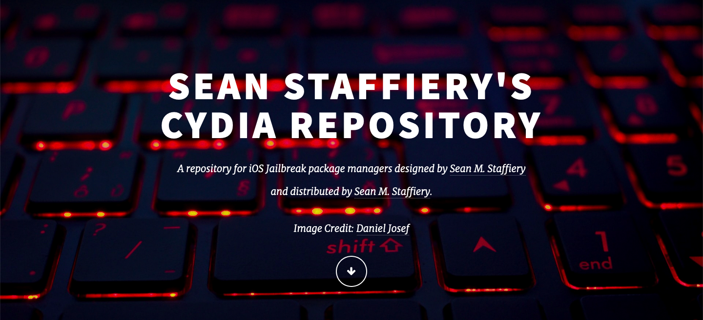

# Cydia Repository

Here you will find my jailbreak repository contents, along with the contents of my repository website. 

<strong>Repo at <a href="https://seanstaffiery.net">seanstaffiery.net</a>. Github Pages clone can be found at <a href="https://gitrepo.seanstaffiery.net/">gitrepo.seanstaffiery.net</a></strong>

<strong>05/15/2021: UI redesign in progress. It should take a few months before finished as I no longer have as much free time with work and other personal duties. Other integrations should speed along faster than the website redesign once finished. </strong>

<strong>03/30/2021: Please see the Github Project Page for important information at <a href="https://github.com/SeanStaffiery/seanstaffiery.github.io/projects">github.com/SeanStaffiery/seanstaffiery.github.io/projects.<a></strong>
 

